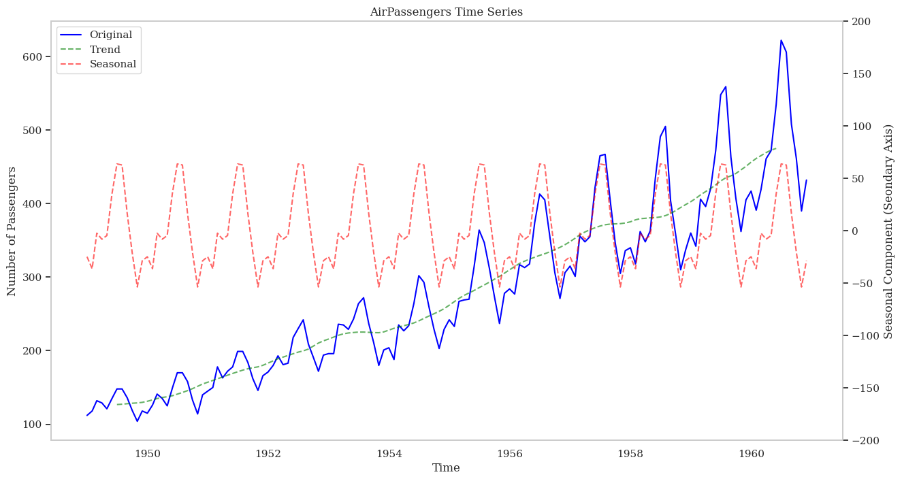
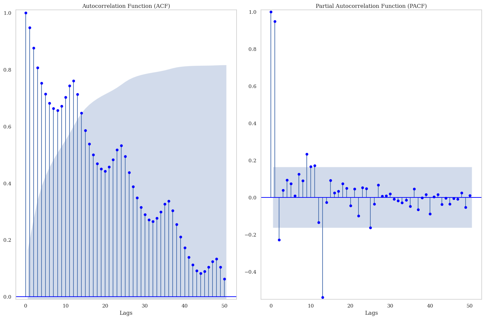

# Practitioner's Guide to Time Series Modelling - I (Classical Time Series Analysis)

Time series data represents a sequence of data points collected over time. Unlike other data types, time series data has a temporal aspect, where the order and timing of the data points matter. This makes time series analysis unique and requires specialized techniques and models to understand and predict future patterns or trends.

## Applications of Time Series Modeling

Time series modelling has a wide range of applications across various fields including:

- **Stock Market Analysis and Forecasting**: Predicting future stock prices, volatility, and market trends.
- **Economic Indicators**: Forecasting GDP, inflation, and unemployment rates.
- **Risk Management**: Assessing and managing financial risk through Value at Risk (VaR) models.
- **Weather Forecasting**: Predicting short-term weather conditions such as temperature and precipitation.
- **Climate Modeling**: Analyzing long-term climate patterns and predicting climate change impacts.
- **Epidemiology**: Tracking and predicting the spread of diseases.
- **Patient Monitoring**: Analyzing vital signs and predicting health events such as heart attacks.
- **Demand Forecasting**: Predicting electricity and gas consumption to optimize production and distribution.
- **Renewable Energy Production**: Forecasting solar and wind power generation based on weather conditions.
- **Sales Forecasting**: Predicting future sales to manage inventory and supply chains effectively.
- **Customer Behavior Analysis**: Understanding and predicting customer purchasing patterns.
- **Predictive Maintenance**: Forecasting equipment failures to perform maintenance before breakdowns occur.
- **Quality Control**: Monitoring production processes to detect anomalies and maintain product quality.
- **Traffic Forecasting**: Predicting traffic flow and congestion to improve urban planning and reduce travel time.
- **Supply Chain Optimization**: Forecasting demand to optimize logistics and reduce costs.
- **Air Quality Monitoring**: Predicting pollution levels and assessing environmental health.
- **Water Resource Management**: Analyzing and predicting water levels and flow in rivers and reservoirs.

## Time Series Characteristics

Time series data are characterized by:

- **Trend**: A long-term increase or decrease in the data.
- **Seasonality**: Influences from seasonal factors, such as the time of year or day of the week, occurring at fixed and known periods.
- **Cyclic Patterns**: Rises and falls that do not occur at a fixed frequency, usually driven by economic conditions and often linked to the "business cycle," typically lasting at least two years [1].

In addition to standard descriptive statistical measures of central tendency (mean, median, mode) and variance, time series is defined by its temporal dependence. Temporal dependence is measured through auto-correlation and partial auto-correlation, which help identify the relationships between data points over time and are essential for understanding patterns and making accurate forecasts.

### Auto-correlation and Partial Auto-correlation

Auto-correlation and partial auto-correlation are statistical measures used in time series analysis to understand the relationship between data points in a sequence.

- **Auto-correlation** measures the similarity between a data point and its lagged versions. It quantifies the correlation between a data point and previous data points in the sequence. Auto-correlation helps identify patterns and dependencies in the data over time and is often visualized using a correlogram, a plot of the correlation coefficients against the lag.
  
- **Partial Auto-correlation** measures the correlation between a data point and its lagged versions while controlling for the influence of intermediate data points. It identifies the direct relationship between a data point and its lagged versions, excluding the indirect relationships mediated by other data points. Partial auto-correlation is also visualized using a correlogram.

Both auto-correlation and partial auto-correlation are useful in time series analysis for several reasons:

- **Identifying Seasonality**: Auto-correlation can help detect repeating patterns or seasonality in the data. Significant correlation at a specific lag suggests the data exhibits a repeating pattern at that interval.
- **Model Selection**: Auto-correlation and partial auto-correlation guide the selection of appropriate models for time series forecasting. By analyzing the patterns in the correlogram, you can determine the order of autoregressive (AR) and moving average (MA) components in models like ARIMA (AutoRegressive Integrated Moving Average).

## Seasonality
Seasonality refers to the regular patterns or fluctuations in time series data that occur at fixed intervals within a year, such as daily, weekly, monthly, or quarterly. Seasonality is often caused by external factors like weather, holidays, or economic cycles. Seasonal patterns tend to repeat consistently over time.

**How to identify seasonality in time-series models**: Seasonality in time-series can be identified by analyzing ACF plots:

* Periodic Peaks: Observing peaks in the ACF plot at regular intervals indicates a seasonal lag. For instance, when analyzing monthly data for yearly seasonality, peaks would typically appear at lags 12, 24, 36, and so on. Similarly, quarterly data would show peaks at lags 4, 8, 12, etc.

* Significant Peaks: Assessing the magnitude of autocorrelation coefficients at seasonal lags helps identify strong seasonal patterns. Higher peaks at seasonal lags compared to others suggest significant seasonality in the data.

* Repetitive Patterns: Checking for repetitive patterns in the ACF plot aligned with the seasonal frequency reveals periodicity. Seasonal trends often exhibit repeated patterns of autocorrelation coefficients at seasonal lags.

* Alternating Positive and Negative Correlations: Occasionally, observing alternating positive and negative autocorrelation coefficients at seasonal lags indicates a seasonal pattern.

* Partial Autocorrelation Function (PACF): Complementing the analysis with PACF helps pinpoint the direct influence of a lag on the current observation, excluding indirect effects through shorter lags. Significant spikes in PACF at seasonal lags further confirm seasonality in the data.

By carefully examining the ACF/PACF plot for these indicators, one can infer the presence of seasonal trends in time series data. This understanding is crucial for selecting appropriate forecasting models and devising strategies to manage seasonality effectively.

The plots above show ACF and PACF Correlograms for the air line passenger data.
* The ACF shows high values for the first few lags, gradually decreasing but still remaining significant for many lags. This indicates a strong autocorrelation in the data, suggesting that past values have a strong influence on future values.
* For PACF there are significant peaks occur at lags 12, 24, etc., this suggests yearly seasonality effect in data.

## Cycles
Cycles, on the other hand, refer to fluctuations in a time series that are not of fixed frequency or period. They are typically longer-term patterns, often spanning several years, and are not as precisely defined as seasonal patterns. Cycles can be influenced by economic factors, business cycles, or other structural changes in the data.

In summary, while both seasonality and cycles involve patterns of variation in time series data, seasonality repeats at fixed intervals within a year, whereas cycles represent longer-term fluctuations that may not have fixed periodicity.

## Stationarity
Stationarity in time series data implies that statistical characteristics, such as mean, variance, and covariance, remain consistent over time. This stability is crucial for various time-series modeling techniques as it simplifies the underlying dynamics, facilitating accurate analysis, modeling, and forecasting. There are two primary types of stationarity in time-series:

### Strict Stationarity: [2]
A time series ${X_t}$ is strictly stationary if the joint distribution of $X_{t_1}, X_{t_2}, \ldots, X_{t_k}$ is the same as that of $X_{t_1+h}, X_{t_2+h}, \ldots, X_{t_k+h}$ for all $h, k \in \mathbb{Z}$ and for all $t_1, t_2, \ldots, t_k $. This means that the statistical properties of the series are invariant to shifts in time. Mathematically ${X_t}$ is strictly stationary:

$$p(X_{t_1}, X_{t_2}, \ldots, X_{t_k}) = p(X_{t_1+h}, X_{t_2+h}, \ldots, X_{t_k+h}) $$
$$\forall h, \forall k, \forall (t_1, t_2, \ldots, t_k )$$

### Covariance Stationarity (Weak Stationarity): [2]
A time series ${X_t}$ is covariance stationary (or weakly stationary) if the following conditions hold:

1. The mean $E[X_t]$ is constant for all $t$.
2. The variance ${Var}(X_t) = E[(X_t - E[X_t])^2]$ is finite and constant for all $t$.
3. The covariance $Cov(X_t, X_{t+h})$ depends only on the lag $h$ and not on $t$

### Unit Roots
 Unit root is a feature of a time series where a single shock can have a persistent effect. This means that the impact of a single, random event can continue to influence the process indefinitely.The concept is closely tied to the idea of stationarity in a time series. A time series is said to be stationary if its statistical properties do not change over time. However, a time series with a unit root is non-stationary, as its mean and variance can change over time.

Unit roots are a problem in time series analysis because they can lead to non-stationarity. A unit root is a root of the characteristic equation of a time series model that is equal to 1. When a time series has a unit root, it means that the series is not stationary and its statistical properties, such as mean and variance, are not constant over time.

### Why is stationarity important?
Non-stationary time series can be problematic for several reasons:

1. Difficulty in modeling: Non-stationary time series violate the assumptions of many statistical models, making it challenging to accurately model and forecast future values. Models like ARIMA (AutoRegressive Integrated Moving Average) assume stationarity, so non-stationary data can lead to unreliable predictions.

2. Spurious regression: Non-stationary time series can result in spurious regression, where two unrelated variables appear to be strongly correlated. This can lead to misleading conclusions and inaccurate interpretations of the relationship between variables.

3. Inefficient parameter estimation: Non-stationary time series can lead to inefficient parameter estimation. The estimates of model parameters may have large standard errors, reducing the precision and reliability of the estimated coefficients.

To address the issue of non-stationarity, techniques like differencing or data transformation can be used to make the time series stationary. Differencing involves taking the difference between consecutive observations to remove the trend or seasonality in the data. Transformations like logarithmic or power transformations can also be applied to stabilize the variance of the series.

**It is important to identify and address non-stationarity in time series analysis to ensure reliable and accurate modeling and forecasting.**

### Dickey-Fuller Test & Augmented Dickey-Fuller Test
The Dickey-Fuller Test and the Augmented Dickey-Fuller Test are statistical tests used to determine if a time series dataset is stationary or not. Stationarity is an important concept in time series analysis, as it assumes that the statistical properties of the data, such as mean and variance, remain constant over time.

### How to make Time Series Stationary if it is not stationary?
* Differencing: For example, First-order Differencing involves subtracting the previous observation from the current observation. If the time series has seasonality, seasonal differencing can be applied.
* Transformations: Techniques like logarithm, square root, or Box-Cox can stabilize the variance.
* Decomposition: Decomposing the time series into trend, seasonal, and residual components.
* Detrending: For instance, subtracting the Rolling Mean or fitting and removing a Linear Trend.

## Modelling Univariate Time Series

### Wold Representation Theorem
The Wold decomposition theorem states that any covariance stationary process can be decomposed into two mutually uncorrelated components. The first component is a linear combination of past values of a white noise process, while the second component consists of a process whose future values can be precisely predicted by a linear function of past observations.

$$ X_t = V_t + S_t $$

where:
- ${V_t}$ is a linearly deterministic process, i.e., a linear combination of past values of $V_t$ with constant coefficients.

- $S_t = {{\sum} _{i=0} ^{\infty}} \psi_i \eta _{t-i}$ is an infinite moving average process of error terms, where

  - $\psi_0 = 1, {{\sum} _{i=0} ^{\infty}} \psi_i^2 < \infty$
  - $\eta_{t}$ is linearly unpredictable white noise, i.e., $E(\eta _{t}) = 0, \ E(\eta _{t} ^2) = \sigma^2, \ E(\eta _{t} \eta _{s}) = 0 \ \forall t, \ \forall s \neq t $
    and $\eta _{t}$ is uncorrelated with $V_t$ i.e. $E(\eta _{t} V_s) = 0, \forall \  t, s$

**The theorem is fundamental in time series analysis, providing a framework for understanding and modeling stationary time series.**

### Lag Operator Representation 
The lag operator (L) helps to succinctly represent the  differencing operations. It shifts a time-series back by one time increment.

* $L(X_t) = X_{t-1}$
* $L^n (X_t) = X_{t-n}$

### Exponential Smoothing
Exponential smoothing is a time series forecasting technique that applies weighted averages to past observations, giving more weight to recent observations while exponentially decreasing the weight for older observations. This method is useful for making short-term forecasts and smoothing out irregularities in the data.

#### Simple Exponential Smoothing:
Simple exponential smoothing is a technique where the forecast for the next period is calculated as a weighted average of the current period's observation and the previous forecast. This technique is suitable for time series data without trend or seasonality.

The forecast for time $t+1$ is calculated as:

$$l_{t+1} = \alpha y_t + \alpha (1 - \alpha) y_{t-1} + \alpha (1 - \alpha)^2 y_{t-2} + \alpha (1 - \alpha)^3 y_{t-3} + \cdots$$

$$
l_{t+1} =  \alpha y_t + (1 - \alpha) l_{t} $$

where:

- $l_{t+1}$ is the forecast for the next time period.
- $\alpha$ is the smoothing parameter (0 < $\alpha$ < 1).
- $y_t$ is the actual value at time $t$.
- $y_{t-1}$ is the actual value at time $t-1$.

### 3. ARMA (AutoRegressive Moving Average) Model
The ARMA model is a popular time series model that combines both autoregressive (AR) and moving average (MA) components. It is used to forecast future values of a time series based on its past values.

The autoregressive (AR) component of the ARMA model represents the linear relationship between the current observation and a certain number of lagged observations. It assumes that the current value of the time series is a linear combination of its past values. The order of the autoregressive component, denoted by p, determines the number of lagged observations included in the model.

The moving average (MA) component of the ARMA model represents the linear relationship between the current observation and a certain number of lagged forecast errors. It assumes that the current value of the time series is a linear combination of the forecast errors from previous observations. The order of the moving average component, denoted by q, determines the number of lagged forecast errors included in the model.

The ARMA model can be represented by the following equation:

$$Y_t = c + \phi_1  Y_{t-1} + \phi_2 Y_{t-2} + ... + \phi_p  Y_{t-p} + \epsilon_t + \beta_1 \epsilon_{t-1} + \beta_2  \epsilon_{t-2} + ... + \beta_q  \epsilon_{t-q}$$

or in lag operator notation:

$$\phi(L) Y_t = (1 + \beta(L)) \epsilon_t$$

where:
- $Y_t$ is the current value of the time series.
- c is a constant term.
- $\phi_1, \phi_2, ..., \phi_p$ are the autoregressive coefficients.
- $ε_t$ is the current forecast error.
- $\beta_1, \beta_2, ..., \beta_q$ are the moving average coefficients.
- $Y_{t-1}, Y_{t-2}, ..., Y_{t-p}$ are the lagged values of the time series.
- $\epsilon_{t-1}, \epsilon_{t-2}, ..., \epsilon_{t-q}$ are the lagged forecast errors.
- $\phi(L) =  1 - \phi_1 L - \phi_2 L^2 - \cdots - \phi_p L^p $
- $\beta(L) = 1 + \beta_1 B + \beta_2 L^2 + \cdots + \beta_q L^q$

The ARMA model is commonly used for time series forecasting and can be estimated using various methods, such as maximum likelihood estimation or least squares estimation.

#### ARIMA Model
 ARIMA includes an integration term, denoted as the "I" in ARIMA, which accounts for non-stationarity in the data. Non-stationarity refers to a situation where the statistical properties of a time series, such as mean and variance, change over time. ARIMA models can handle non-stationary data by differencing the series to achieve stationarity.

In ARIMA models, the integration order (denoted as "d") specifies how many times differencing is required to achieve stationarity. This is a parameter that needs to be determined or estimated from the data. ARMA models do not involve this integration order parameter since they assume stationary data.

e.g $y_t$ original series

* First Order ARIMA will be: $z_t = y_{t+1} - y_t$
* Second Order ARIMA will be: $k_t = z_{t+1} - z_t$

#### SARIMA

SARIMA stands for Seasonal AutoRegressive Integrated Moving Average model. It is an extension of the ARIMA model that incorporates seasonality into the modeling process. SARIMA models are particularly useful when dealing with time series data that exhibit seasonal patterns.

#### How to address seasonality:
* Identify seasonal component: Seaonsl component can be identified via ACF/PACF or SLT decomposition.
* Remove Seasonality: Once the seasonal component has been identified, it needs to be removed from the original data. This can be achieved by differencing the data at seasonal intervals. For example, if the data exhibits monthly seasonality, you can difference the data by subtracting each observation from the observation from the same month in the previous year.
* Fit ARIMA Model: After removing seasonality, fit an ARIMA model to the deseasonalized data. ARIMA models are effective for modeling the remaining non-seasonal components of the time series, including trend and random noise.

#### SARMIAX
The SARIMAX model is defined by the parameters (p, d, q) and (P, D, Q, s):

- **(p, d, q)**: These are the non-seasonal parameters.
  - **p**: The order of the non-seasonal AutoRegressive (AR) part.
  - **d**: The number of non-seasonal differences needed to make the series stationary.
  - **q**: The order of the non-seasonal Moving Average (MA) part.

- **(P, D, Q, s)**: These are the seasonal parameters.
  - **P**: The order of the seasonal AutoRegressive (AR) part.
  - **D**: The number of seasonal differences needed to make the series stationary.
  - **Q**: The order of the seasonal Moving Average (MA) part.
  - **s**: The length of the seasonal cycle (e.g., s=12 for monthly data with yearly seasonality).

- **Exogenous Variables (X)**: These are external variables that can influence the time series but are not part of the series itself. For example, economic indicators or weather data might be included as exogenous variables.

#### Non-seasonal AR and MA Components:
AR: $\phi(L) = 1 - \phi_1 L - \phi_2 L^2 - \dots - \phi_p L^p$

MA: $\theta(L) = 1 + \theta_1 L + \theta_2 L^2 + \dots + \theta_q L^q$ 

#### Seasonal AR and MA Components:

SAR: $\Phi(L^s) = 1 - \Phi_1 L^s - \Phi_2 L^{2s} - \dots - \Phi_P L^{Ps}$

SMA: $\Theta(L^s) = 1 + \Theta_1 L^s + \Theta_2 L^{2s} + \dots + \Theta_Q L^{Qs}$

#### SARIMAX Model Equation:

$\Phi(L^s)\phi(L)(1 - L)^d (1 - L^s)^D y_t = \Theta(L^s)\theta(L)\varepsilon_t + \mathbf{X}_t \beta $

- $\Phi(L^s)\phi(L)$: captures the non-seasonal and seasonal AR terms.
- $\Theta(L^s)\theta(L)$: captures the non-seasonal and seasonal MA terms.
- $(1 - L)^d (1 - L^s)^D$: represents the differencing operations, making the series stationary.
- $\mathbf{X}_t$: represents the exogenous variables with their coefficients $\beta$.
- $\varepsilon_t$: represents the residuals (white noise).

\
\
\
\

$$
y_t  = c + \phi_1 y_{t-1} + \phi_2 y_{t-2} + \cdots + \phi_p y_{t-p} + \\ 
   \theta_1 \epsilon_{t-1} + \theta_2 \epsilon_{t-2} + \cdots + \theta_q \epsilon_{t-q} + \\
   \Phi_1 y_{t-s} + \Phi_2 y_{t-2s} + \cdots + \Phi_P y_{t-Ps} +  \\
   \Theta_1 \epsilon_{t-s} + \Theta_2 \epsilon_{t-2s} + \cdots + \Theta_Q \epsilon_{t-Qs} + \\
    \beta_1 x_{1,t} + \beta_2 x_{2,t} + \cdots + \beta_k x_{k,t} + 
    \epsilon_t
$$

Where:
- $y_t$: The value of the time series at time t.
- $c$: Constant term.
- $\phi_i$: Parameters for non-seasonal autoregressive terms.
- $\theta_j$: Parameters for non-seasonal moving average terms.
- $\epsilon_t$: Error term at time t.
- $\Phi_i$: Parameters for seasonal autoregressive terms.
- $\Theta_j$: Parameters for seasonal moving average terms.
- $\beta_i$: Parameters for the exogenous variables $x_{i,t}$.

###  Example SARIMAX Model
#### SARIMA (1, 1, 0)x(0, 1, 0, 12)
The SARIMA can be decomposed into two parts: the non-seasonal ARIMA component and the seasonal component.
* Non-Seasonal ARIMA(1,1,0) Component
  - $ d=1 \implies Z_t = W_t - W_{t-1} $
  - $ p = 1 \ \& \ q=0 \implies Z_t = \phi_1 Z_{t-1} + 
\epsilon_t $
  * This yeilds: $ W_t = (1 + \phi_1) W_{t-1} - \phi_1 W_{t-2} + \epsilon_t $
* Seasonal (0,1,0)[12] Component
  - $s = 12$ Seasonal period of 12 (monthlty data)
  - $ D=1 \implies W_t = Y_t - Y_{t-12} $
  - $ P = 0 \ \& \ Q=0 \implies$ no AR and MA terms
* Combined SARIMA Model
  1. Seasonal Model:  $W_t =  Y_t - Y_{t-12}$
  2. Non-seasonal Model: $W_t = (1 + \phi_1) W_{t-1} - \phi_1 W_{t-2} + \epsilon_t $
  - Substitue (1) in (2): $ Y_t - Y_{t-12} = (1 + \phi_1) (Y_{t-1} - Y_{t-13}) - \phi_1 (Y_{t-2} - Y_{t-14}) + \epsilon_t $

Rearranging gives the final equation for the SARIMA(1,1,0)(0,1,0)[12] model:

$ Y_t = Y_{t-12} + (1 + \phi_1) (Y_{t-1} - Y_{t-13}) - \phi_1 (Y_{t-2} - Y_{t-14}) + \epsilon_t $

$$
\underbrace{(1 - \phi_1 B)}_{\text{(Non-seasonal) AR(1)}} \underbrace{(1 - \Phi_1 B^{s})}_{\text{Seasonal AR(1)}} (1 - B)(1 - B^{s}) y_t = \underbrace{(1 + \theta_1 B)}_{\text{(Non-seasonal) MA(1)}} \underbrace{(1 + \Theta_1 B^{s})}_{\text{Seasonal MA(1)}} e_t
$$

## Modelling Volatility
Volatility in the context of time series refers to the degree of variation or dispersion in the series over time. It is a measure of how much the series deviates from its average or expected value. Volatility is particularly relevant in financial markets but can also apply to other types of time series data where variability is important to understand or predict.

Volatility in a time series, particularly in the context of finance, is often measured as the annualized standard deviation change in price or value of a financial security  e.g. for asset price voltatilty is computed as follows [MIT Course]

* Given asset Prices at $(T + 1)$ Time Points: 

$$\{P _{t}, \quad t = 0, 1, 2, \ldots, T\}$$

* Asset Returns for $T$ Time Periods is computed as:

$$R_t = \log(P_t / P_{t-1}), \quad t = 1, 2, \ldots, T$$

* Assuming Covariance Stationarity of $\{R_t\}$, standard deviation is computed as:

$$\sigma = \sqrt{\text{var}(R_t)} = \sqrt{E[(R_t - E[R_t])^2]}$$

  with the sample estimate:
  
$$\hat{\sigma} = \sqrt{\frac{1}{T-1} \sum_{t=1}^T (R_t - \bar{R})^2}, \quad \text{where} \quad \bar{R} = \frac{1}{T} \sum_{t=1}^T R_t$$

* Annualized Volatility:

$$\hat{\text{voltality}} = 
  \begin{cases}
    \sqrt{252} \hat{\sigma} & \text{(daily prices, assuming 252 trading days/year)} \\
    \sqrt{52} \hat{\sigma} & \text{(weekly prices)} \\
    \sqrt{12} \hat{\sigma} & \text{(monthly prices)}
  \end{cases}$$

### Simple Methods to Model Volatility
####  Historical Average
The historical average method estimates the volatility at time step $t+1$ as the mean of past observed variances:

$$
\tilde{\sigma}^2_{t+1} = \frac{1}{t} \sum_{j=1}^t \hat{\sigma}^2_j
$$

$\hat{\sigma}^2_j$ represents the squared volatility observed at time $j$.

#### Simple Moving Average
The simple moving average (SMA) estimates volatility at time step $t+1$ by averaging the squared volatilities of the last $m$ data points:

$$
\tilde{\sigma}^2_{t+1} = \frac{1}{m} \sum_{j=0}^{m-1} \hat{\sigma}^2_{t-j}
$$

Here, $\hat{\sigma}^2_{t-j}$ represents the squared volatility observed at time $t-j$, and $m$ is the number of data points used in the moving average.

#### Exponential Moving Average (EMA)
The exponential moving average gives more weight to recent observations while exponentially decreasing the weights of older observations. It estimates volatility at time step $t+1$ as:

$$
\tilde{\sigma}^2_{t+1} = (1 - \beta) \hat{\sigma}^2_t + \beta \tilde{\sigma}^2_t
$$

Here, $\hat{\sigma}^2_t$ is the squared volatility observed at the current time $t$, $\tilde{\sigma}^2_t$ is the previous estimate of volatility, and $\beta$ is a smoothing factor where $0 \leq \beta \leq 1$.

#### Exponential Weighted Moving Average (EWMA)

Similar to EMA, EWMA estimates volatility at time step $t+1$ using an exponentially weighted average of past squared volatilities:

$$
\tilde{\sigma}^2_{t+1} = \frac{\sum_{j=0}^{m-1} (\beta^j \hat{\sigma}^2_{t-j})}{\sum_{j=0}^{m-1} \beta^j}
$$

Here, \( \hat{\sigma}^2_{t-j} \) are the squared volatilities observed at previous time steps, \( \beta \) is the smoothing factor, and \( m \) is the number of data points considered in the calculation.

#### Simple Regression Model

A simple regression model can be employed to predict volatility based on its previous values. For example, a linear regression model might be formulated as:

$$
\hat{\sigma}^2_{t+1} = \alpha + \beta_1 \hat{\sigma}^2_t + \beta_2 \hat{\sigma}^2_{t-1} + \ldots + \beta_p \hat{\sigma}^2_{t-p+1} + \epsilon_{t+1}
$$

where $\hat{\sigma}^2_t, \hat{\sigma}^2_{t-1}, \ldots, \hat{\sigma}^2_{t-p}$ are lagged values of volatility up to $p$ periods before time $t$, $\alpha$ is the intercept term, $\beta_1, \beta_2, \ldots, \beta_p$ are coefficients representing the influence of each lagged volatility term, and $\epsilon_{t+1}$ is the error term.

This approach allows capturing the temporal dependency of volatility over previous periods and can be extended to include additional explanatory variables or refine the model complexity based on data characteristics and modeling objectives.

| **Method**                           | **Description**                                                                                                                                                                                                                                       | **Formula**                                                                                                                                                                              |
|--------------------------------------|-------------------------------------------------------------------------------------------------------------------------------------------------------------------------------------------------------------------------------------------------------|------------------------------------------------------------------------------------------------------------------------------------------------------------------------------------------|
| **Historical Average**               | Estimates volatility as the mean of past observed variances.                                                                                                                                                                                          | $\tilde{\sigma}^2_{t+1} = \frac{1}{t}  {\sum} _{j=1} ^{t} \hat{\sigma}^2_j$                                                                                                                     |
| **Simple Moving Average**      | Averages the squared volatilities of the last $m$ data points.                                                                                                                                                        | $\tilde{\sigma}^2_{t+1} = \frac{1}{m}  {\sum} _{j=0} ^{m-1} \hat{\sigma}^{2}_ {t-j}$                                                                                                       |
| **Exponential Moving Average** | Gives more weight to recent observations and decreases the weights of older ones exponentially.                                                                                                                                                        | $\tilde{\sigma}^2_{t+1} = (1 - \beta) \hat{\sigma}^2_t + \beta \tilde{\sigma}^2_t$                                                                                                       |
| **Exponential Weighted Moving Average** | Uses an exponentially weighted average of past squared volatilities.                                                                                                                                                        | $\tilde{\sigma}^2_{t+1} = \frac{ {\sum} _{j=0} ^{m-1} (\beta^j \hat{\sigma}^2_{t-j})}{ {\sum} _{j=0} ^{m-1} \beta^j}$                                                                              |
| **Simple Regression Model**          | Predicts volatility based on its previous values using a linear regression model.                                                                                                                                                                     | $\hat{\sigma}^2_{t+1} = \alpha + \beta_1 \hat{\sigma}^2_t + \beta_2 \hat{\sigma}^2_{t-1} + \ldots + \beta_p \hat{\sigma}^2_{t-p+1} + \epsilon_{t+1}$                                     |

### ARCH Model
ARCH (Autoregressive Conditional Heteroskedasticity) models are a class of models used in econometrics and financial econometrics to analyze time series data, particularly in the context of volatility clustering. These models are designed to capture the time-varying volatility or heteroskedasticity in financial time series data, where the volatility of the series may change over time.

> In statistics, a sequence of random variables is homoscedastic if all its random variables have the same finite variance; this is also known as homogeneity of variance. The complementary notion is called heteroscedasticity, also known as heterogeneity of variance [1]

The basic idea behind ARCH models is that the variance of a time series can be modeled as a function of its own past values, along with possibly some exogenous variables. In other words, the variance at any given time is conditional on the past observations of the series. 

#### ARCH (1) Model Derivation
$$y_t = log(P_t/P_{t-1})$$

It posits that the observed value at time t can be decomposed into an average component $\mu$ and a noise term $𝑎(𝑡)$

$$ 𝑦(𝑡)= \mu + 𝑎(𝑡) $$ 

The noise term $𝑎(𝑡)$ is further defined as the product of a time dependent volatility term $\sigma(t)$ and a stochastic noise component $\epsilon (t)$

$$𝑎(𝑡)=\sigma(𝑡) \epsilon(𝑡)$$

In the ARCH model, the volatility term $\sigma(𝑡)$ is modeled as a function of past values of the noise term $a(t)$. Specifically, the ARCH(1) model (the simplest form) defines $\sigma (t)$ as:

$$\sigma(t) = \sqrt{\alpha_0 + \alpha_1 * a^2 _{t-1}}$$ 
 
Where $\alpha_0, \alpha_1$ are the parameters of the model and $𝑎_{𝑡−1}$ is the volatility at the last timestep.

#### ARCH (p) Model
The ARCH(1) model can be generalized to an ARCH(p) model, where the volatility term depends on the past $p$ values of the noise term $a(t)$:

$$ \text{ARCH}(p): \quad \sigma^2_t = \alpha_0 + \alpha_1 a^2_{t-1} + \alpha_2 a^2_{t-2} + \ldots + \alpha_p a^2_{t-p} $$

where:
- $ \sigma^2_t $ is the conditional variance of the time series at time t.
- $a_t$ is the error term at time t.
- $\alpha_0, \alpha_1, \alpha_2, \ldots, \alpha_p$ are parameters to be estimated.
- $p$ is the order of the ARCH model, indicating how many past squared residuals are included in the model.

The final formulation of the ARCH(p) model is:

1. The observed value:
   $$y(t) = \mu + a(t)$$

2. The noise term:
   $$a(t) = \sigma(t) \epsilon(t)$$

3. The volatility term:
   $$\sigma^2(t) = \alpha_0 + \sum_{i=1}^{p} \alpha_i a^2(t-i)$$
   where $\epsilon(t)$ is white noise with zero mean and unit variance ($ \epsilon(t) \sim N(0, 1) $).

To estimate the parameters, one typically uses maximum likelihood estimation (MLE) or other estimation techniques. Once the parameters are estimated, the model can be used to forecast the conditional variance of the time series into the future.

### GARCH Model
GARCH model is extenstion of ARCH Model. It models time series as a function of previous states value as well volatality. GARCH compared to ARCH takes volatality of time-series into account.

The volatility term $\sigma^2(t)$ in the GARCH(1, 1) model is defined as:

 $$\sigma^2(t) = \alpha_0 + \alpha_1 a^2(t-1) + \beta_1 \sigma^2(t-1)$$

The ARCH and GARCH models are crucial in modeling time series data with time-varying volatility. ARCH models capture conditional heteroskedasticity by modeling volatility as a function of past squared errors, while GARCH models extend this to include past volatility terms, providing a more comprehensive framework for volatility modeling.

 

## Review - ARMA & GARCH
* AR/ARMA Models: Best suited for stationary time series data, where statistical properties like mean and variance are constant over time. Useful for short-term forecasting, ARMA models combine both autoregressive (AR) and moving average (MA) components to capture the dynamics influenced by past values and past forecast errors.

* AR Models: Used when the primary relationship in the data is between the current value and its own past values. Suitable for time series where residuals show no significant autocorrelation pattern, indicating that past values alone sufficiently explain the current observations.

* ARMA Models: Employed when both past values and past forecast errors significantly influence the current value. This combination provides a more comprehensive model for capturing complex dynamics in time series data.

* ARCH Models: Best suited for time series data with volatility clustering but lacking long-term persistence. ARCH models capture bursts of high and low volatility effectively by modeling changing variance over time based on past errors.

* GARCH Models: Extend ARCH models by incorporating past variances, allowing them to handle more persistent volatility. GARCH models are better at capturing long-term dependencies in financial time series data, making them suitable for series with sustained periods of high or low volatility.

## Multivariate Time Series
A multivariate time series is a collection of multiple time-dependent series of data. Unlike a univariate time series, which consists of a single sequence of observations recorded at regular intervals, a multivariate time series consists of multiple sequences that may be related or interact with each other over time.

$$ \{\mathbf{X}_t \}  =  \ldots, \mathbf{X}_{t-1}, \mathbf{X}_t, \mathbf{X}_{t+1}, \ldots $$ 

represent an $m$-dimensional stochastic process composed of random $m$-vectors:

$$
\mathbf{X}_t = (X_{1,t}, X_{2,t}, \ldots, X_{m,t})',
$$

where $\mathbf{X}_t$ is a random vector in $\mathbb{R}^m$. The process $\{ \mathbf{X}_t \}$ consists of $m$ component time series:

$$
\{ X_{1,t} \}, \{ X_{2,t} \}, \ldots, \{ X_{m,t} \}.
$$

A multivariate time series is considered **covariance stationary** if its statistical properties, such as mean, variance, and covariance, do not change over time. In other words, the process is invariant to time shifts. For multivariate time series, this concept extends to the relationships between multiple time series.

1. Constant Mean:

   The mean vector $\mu$ of the time series $\mathbf{X}_t$ is constant over time.
   $$
   E[\mathbf{X}_t] = \mu = \begin{bmatrix} \mu_1 \\ \mu_2 \\ \vdots \\ \mu_m \end{bmatrix} \quad \forall t
   $$

3. Constant Covariance:

   The covariance between any pair of component time series $X_{i,t}$ and $X_{j,t}$  is constant over time i.e. the covariance matrix $\Sigma$ of $\mathbf{X}_t$ is constant over time:

   $$
   \Sigma = E[(\mathbf{X}_t - \mu)(\mathbf{X}_t - \mu)'] = \begin{bmatrix} 
   \text{var}(X_{1,t}) & \text{cov}(X_{1,t}, X_{2,t}) & \ldots & \text{cov}(X_{1,t}, X_{m,t}) \\
   \text{cov}(X_{2,t}, X_{1,t})& \text{var}(X_{2,t}) & \ldots & \text{cov}(X_{2,t}, X_{m,t}) \\
   \vdots & \vdots & \ddots & \vdots \\
   \text{cov}(X_{m,t}, X_{1,t}) & \text{cov}(X_{m,t}, X_{2,t}) & \ldots & \text{var}(X_{m,t})
   \end{bmatrix}
   $$

4. Constant Cross-Covariance:

   The cross-covariance between the component time series at different lags is only a function of the time lag and not of time itself. Formally, the cross-covariance function $ \Gamma_{ij}(k)$ between $X_{i,t}$ and $X_{j,t}$ at lag $k$ is given by:
   $$
   \Gamma_{ij}(k) = \text{Cov}(X_{i,t}, X_{j,t+k}) = E[(X_{i,t} - \mu_i)(X_{j,t+k} - \mu_j)]
   $$

### Multivariate Wold Decomposition Wold Representation Theorem {MIT Tims series II}

Any multivariate covariance stationary time series $\{ \mathbf{X}_t \}$ (where each $\mathbf{X}_t$ is $m$-dimensional) can be decomposed as:

$$
\mathbf{X}_t = \mathbf{V}_t + \eta_t + \Psi_1 \eta_{t-1} + \Psi_2 \eta_{t-2} + \cdots
$$

or equivalently,

$$
\mathbf{X}_t = \mathbf{V}_t + \sum_{k=0}^{\infty} \Psi_k \eta_{t-k}
$$

where:

- $\{ \mathbf{V}_t \}$ is an $m$-dimensional linearly deterministic process.
- $\{ \eta_t \}$ is a multivariate white noise process, satisfying:
  - $E[\eta_t] = \mathbf{0}_m$ (an $m \times 1$ vector)
  - $\text{Var}[\eta_t] = E[\eta_t \eta_t^T] = \Sigma_\eta$, a positive semi-definite $(m \times m)$ matrix
  - $\text{Cov}[\eta_t, \eta_{t-k}] = E[\eta_t \eta_{t-k}^T] = \mathbf{0}$ for all $k \neq 0$ (an $m \times m$ matrix)
  - $\text{Cov}[\eta_t, \mathbf{V}_t] = \mathbf{0}$ for all $k$ (an $m \times m$ matrix)

- The terms $\{ \Psi_k \}$ are $m \times m$ matrices such that:
  - $\Psi_0 = I_m$ (the $m \times m$ identity matrix)
  - $\sum_{k=0}^{\infty} \Psi_k \Psi_k^T$ converges.

In summary, the Wold Representation Theorem states that any multivariate covariance stationary time series can be expressed as a sum of a deterministic component and a stochastic component represented by a series of lagged white noise terms.

## Modelling multivariate time-series 

### 9. Vector Autoregression

Vector autoregressive models are used for multivariate time series. It is used capture the linear interdependencies among multiple time series. The VAR model generalizes the univariate autoregressive (AR) model by allowing for more than one evolving variable. The structure is that each variable is a linear function of past lags of itself and past lags of the other variables [2].

#### Three-Variable VAR(1) Model

Consider a three-variable time series $ \mathbf{y}_t = (y_{1t}, y_{2t}, y_{3t})' $. The VAR(1) model for this time series can be written as:

$$
y_{t,1} = \alpha_{0,1} +  \alpha_{11}y_{t-1,1} +  \alpha_{12}y_{t-1,2} +  \alpha_{13}y_{t-1,3} + \epsilon_{t,1}
$$

$$
y_{t,2} = \alpha_{0,2} +  \alpha_{21}y_{t-1,1} +  \alpha_{22}y_{t-1,2} +  \alpha_{23}y_{t-1,3} + \epsilon_{t,1}
$$

$$
y_{t,3} = \alpha_{0,3} +  \alpha_{31}y_{t-1,1} +  \alpha_{32}y_{t-1,2} +  \alpha_{33}y_{t-1,3} + \epsilon_{t,1}
$$

i.e. each variable is a linear function of the lag 1 values for all variables in the set. This in matrix form can be expressed as:
$$
\mathbf{Y}_t = \mathbf{\alpha_0} + \mathbf{A}_1 \mathbf{Y}_{t-1} + \mathbf{\epsilon}_t
$$

where:
- $ \mathbf{Y}_t$ is a 3x1 vector of time series variables at time $ t $.
- $ \mathbf{\alpha_0} $ is a 3x1 vector of intercept terms.
- $ \mathbf{A}_1 $ is  a 3x1 coefficient matrix.
- $ \mathbf{\epsilon}_t $ is a  3x1 vector of error terms (white noise).

### Granger Causality
> The Granger causality test is a statistical hypothesis test for determining whether one time series is useful in forecasting another [3]. It assesses whether past values of one variable $X$ provide statistically significant information about future values of another variable $Y$.

1. The method involves constructing regression models:

   - An AR model where $Y $is regressed on its own past values.
   - A VAR model where $Y$ is regressed on its own past values and past values of $X$.

2. Hypothesis Testing - The primary statistical test involves a null hypothesis that $X$ does not Granger-cause $Y$. If adding past values of $X$ improves the prediction of $Y$ significantly, the null hypothesis is rejected, indicating that $X$ Granger-causes $Y$.

Granger causality does not imply true causality in the philosophical sense; it only indicates predictive causality based on the given data.

# 7. Model Selection
When analyzing time series data, selecting the appropriate model (e.g., AR vs ARMA) and determining the model's order is crucial for making accurate predictions. Several methods can be used for model selection:

###  Akaike Information Criterion  (AIC)
$$AIC=2k−2ln(L)$$
where,
* $k$ - Number of parameters in the model
* $L$ - Likelihood function for the model
A lower AIC value indicates a better model.

### Bayesian Information Criterion (BIC)
$$BIC=kln(n)−2ln(L)$$
where,
* $k$ - Number of parameters in the model.
* $n$ - Number of data points.
* $L$ - Likelihood function for the model.
A lower BIC value indicates a better model.

### Hannan-Quinn Criterian
$$HQ = 2k \ln(\ln(n)) - 2\ln(L)$$

where:
- $k$  - Number of parameters in the model
- $n$ - Number of data points
- $L$ - Likelihood function for the model
A lower HQ value indicates a better model.

### Cross Validation
Cross-validation involves dividing the time series into training and testing sets to evaluate the model's performance. A common method is time series cross-validation, where the data is split into multiple training and validation sets in a rolling or expanding window manner. Use metrics such as Mean Squared Error (MSE) or Mean Absolute Error (MAE) to evaluate performance to choose the best model.

https://www.youtube.com/playlist?list=PLRRxOfxVBikdM1SbWQlCd8ENfN8ZuJ_js
https://github.com/AileenNielsen/TimeSeriesAnalysisWithPython

## References
1. Hyndman, R.J., & Athanasopoulos, G. (2021) Forecasting: principles and practice, 3rd edition, OTexts: Melbourne, Australia. OTexts.com/fpp3. Accessed on 01 July 2024.
2. MIT, Topics in mathematics with application in finance. https://ocw.mit.edu/courses/18-s096-topics-in-mathematics-with-applications-in-finance-fall-2013/pages/lecture-notes/
1. https://en.wikipedia.org/wiki/Homoscedasticity_and_heteroscedasticity
2. https://online.stat.psu.edu/stat510/lesson/11/11.2
3. https://en.wikipedia.org/wiki/Granger_causality
4. chrome-extension://efaidnbmnnnibpcajpcglclefindmkaj/http://lethalletham.com/ForecastingAtScale.pdf
5. https://uk.mathworks.com/help/ident/ug/what-are-state-space-models.html

#############################

#########################
# Practitioner's Guide to Time Series Modelling - III | Model Time Series Analaysis

-----------------------------------------
## Linear State Space Representation
"State-space models are models that use state variables to describe a system by a set of first-order differential or difference equations, rather than by one or more nth-order differential or difference equations. If the set of first-order differential equation is linear in the state and input variables, the model is referred to as a linear state space model. [5 matlab]"

### State Space Formulation [MIT TimeSeries III]

- $ \mathbf{y}_t $: ($ k \times 1 $) observation vector at time $ t $
- $ \mathbf{s}_t $: ($ m \times 1 $) state vector at time $ t $
- $ \mathbf{\epsilon}_t $: ($ k \times 1 $) observation error vector at time $ t $
- $ \mathbf{\eta}_t $: ($ n \times 1 $) state transition innovation/error vector

#### State Equation

$$
\mathbf{s}_{t+1} = \mathbf{T}_t \mathbf{s}_t + \mathbf{R}_t \mathbf{\eta}_t
$$

where:
- $ \mathbf{T}_t $: ($ m \times m $) transition coefficients matrix
- $ \mathbf{R}_t $: ($ m \times n $) fixed matrix, often consisting of column(s) of $ I_p $
- $ \mathbf{\eta}_t $: i.i.d. $ N(\mathbf{0}_n, \mathbf{Q}_t) $, where $ \mathbf{Q}_t $ ($ n \times n $) is positive definite

#### Observation Equation Equation

$$
y_t = Z_t s_t + \epsilon_t
$$

where
- $ Z_t $: ($ k \times m $) observation coefficients matrix
- $ \epsilon_t $: i.i.d. $ N(0_k, H_t) $, where $ H_t $ ($ k \times k $) is positive definite.

#### Joint Equation

$$
\begin{bmatrix}
s_{t+1} \\
y_t
\end{bmatrix}
=
\begin{bmatrix}
T_t \\
Z_t
\end{bmatrix}
s_t
+
\begin{bmatrix}
R_t \eta_t \\
\epsilon_t
\end{bmatrix}
=
\Phi_t s_t + u_t,
$$

where
$$
u_t =
\begin{bmatrix}
R_t \eta_t \\
\epsilon_t
\end{bmatrix}
\sim N(0, \Omega), \text{ with } \Omega =
\begin{bmatrix}
R_t Q_t R_t^T & 0 \\
0 & H_t
\end{bmatrix}
$$

**Note**: Often the model is time-invariant ($ T_t, R_t, Z_t, Q_t, H_t $ constants).

### Kalman Filter
The Kalman Filter is the recursive algoirthm to estimate the state of a system from a series of noisy measurements over time. It operates in two main phases:

https://www.kalmanfilter.net/background.html

https://www.udacity.com/course/time-series-forecasting--ud980

https://github.com/MaxBenChrist/awesome_time_series_in_python

https://www.youtube.com/watch?v=v5ijNXvlC5A

https://www.kevinkotze.org/time-series-analysis

# Linear State-space model 

# 9. Bayesian Time Series
Bayesian time series modelling incorporates Bayesian statistical methods to model and analyze time-dependent data. It leverages prior distributions along with observed data to make inferences about the underlying processes generating the time series. Bayesian methods provide a coherent framework for incorporating prior knowledge and quantifying uncertainty in parameter estimates.

# 10. Prophet Model 
Prophet, developed by Facebook (S. J. Taylor & B. Letham, 2018), is a robust forecasting tool designed initially for predicting daily data with inherent weekly and yearly seasonal patterns, including the effect of holidays. It has since evolved to accommodate a broader range of seasonal data types. [FB paper]

## Model Overview
Prophet is an additive regression model expressed in the form:

$$y_t = g(t) + s(t) + h(t) + \epsilon_t $$

- $g(t)$: Represents the trend and models the nonlinear trend via a piecewise linear or logistic growth curve.
- $s(t)$: Models the yearly, weekly, and daily seasonal patterns using Fourier series.
- $h(t)$: Incorporates the effects of holidays using dummy variables.
- $\epsilon_t$: Denotes the white noise error term.

The model parameters, including changepoints for the piecewise linear components of the trend and seasonal components, are estimated using a Bayesian approach. This allows for the automatic determination of changepoints and other model characteristics, enhancing the model's flexibility and accuracy.

# 11. Recurrent Neural Networks

## LSTM 

chrome-extension://efaidnbmnnnibpcajpcglclefindmkaj/https://www.scb.se/contentassets/ca21efb41fee47d293bbee5bf7be7fb3/stl-a-seasonal-trend-decomposition-procedure-based-on-loess.pdf

https://www.pymc.io/projects/docs/en/stable/learn.html
https://facebook.github.io/prophet/
https://cs.idc.ac.il/~kipnis/teaching.html

# Practitioner's Guide to Time Series Modelling - II | EDA, Data Processing

## Data Preprocessing
Steps for pre-processing of time-series data:

1. Normalization - Normalize the data so the mean of the time-series is 0 and the standard deviation is 1. This can be achieved by subtracting the mean and dividing by the standard deviation of the time-series.

2. Remove Trend - Remove the trend by taking the first difference of the time-series. This helps to stabilize the mean of the time-series and remove long-term trends.

3. Remove Changing Volatility - If the data exhibits changing volatility, this can be addressed by computing the yearly standard deviation and dividing each data point by the corresponding year's standard deviation. This step helps to stabilize the variance of the time-series.

4. Remove Seasonal Effect - Compute the mean for all months across all years and subtract the data point by its month's average. This helps in removing any seasonal patterns that might be present in the data.

5. Handle Missing Values - Identify and handle any missing values in the time-series. Common methods include interpolation, forward filling, or using statistical methods to estimate and fill in the missing data.

6. Outlier Detection and Treatment - Detect and treat any outliers in the data, which might skew the results. Outliers can be treated by capping, flooring, or using more advanced statistical methods to adjust their impact.

7. Stationarity Check - Ensure the time-series is stationary, meaning its statistical properties like mean, variance, and autocorrelation are constant over time. Use techniques such as the Augmented Dickey-Fuller (ADF) test to check for stationarity. If the series is not stationary, further transformations such as differencing or logarithmic transformations might be necessary.

8. Lagged Features Creation - Create lagged features to capture the temporal dependencies in the data. This involves creating new features that represent previous time points of the series.

9. Feature Engineering - Engineer additional features that might help in modeling the time-series data, such as rolling statistics (mean, variance), time-based features (day of the week, month, quarter), and external factors (e.g., holidays, weather conditions).

## Anomaly Detection
Anomalies refer to data values or events that deviate significantly from the normal trend. Detecting and correcting anomalies is crucial before any analysis of data, as anomalies can lead to incorrect results and conclusions. However, the time dependence and often non-stationary nature of time series data make anomaly detection particularly complex.

Anomaly detection methods:

1. Z-Score Method - calculates the standard score of each data point to identify anomalies.
2. Moving Average with Standard Deviation -  deviation of the point from the rolling moving average and standard deviation.
3. Isolation Forest - an ensemble method designed for anomaly detection.
4. One-Class SVM - One-Class Support Vector Machines can be used for anomaly detection.
5. Kmeans clustering - unsupervised clustering can help identify anomalies.
6. STL decomposition - “Seasonal and Trend decomposition using Loess”  decomposes time series into it seasonal, trend, and residue components. Residue component can be used to identify anomalies.
7. Detection using Forecasting -  In forecasting we predict each point based on past data points using a forecasting method such as ARMA model. The deviation of actual value from the prediction can be used to identify anomalies.

## References
0. https://otexts.com/fpp3/ 
1. https://en.wikipedia.org/wiki/Homoscedasticity_and_heteroscedasticity
2. https://online.stat.psu.edu/stat510/lesson/11/11.2
3. https://en.wikipedia.org/wiki/Granger_causality
4. chrome-extension://efaidnbmnnnibpcajpcglclefindmkaj/http://lethalletham.com/ForecastingAtScale.pdf
5. https://uk.mathworks.com/help/ident/ug/what-are-state-space-models.html

Next Topic
Generalized ME
https://www.youtube.com/watch?v=uBeM1FUk4Ps&list=PLUl4u3cNGP63ctJIEC1UnZ0btsphnnoHR&index=7

                               

